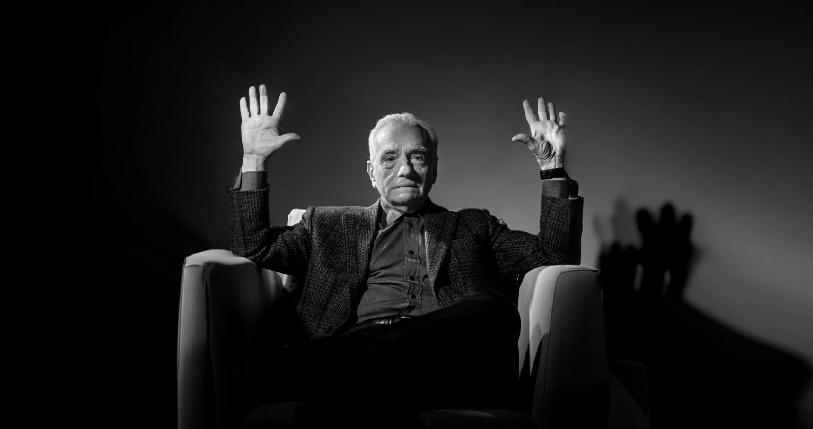

# Лабораторная работа №1

### **ФИО:** Конкин Александр Александрович
### **Группа:** 6402-010302D
### **Научный руководитель:** Минаев Евгений Юрьевич
### **Тема диплома:** Разарботка метода одновременной локализации и построения карты с использованием нейросетевых алгоритмов реконструкции сцены
> ### "Absolute cinema"
>
> #### — *Мартин Скорсезе*
