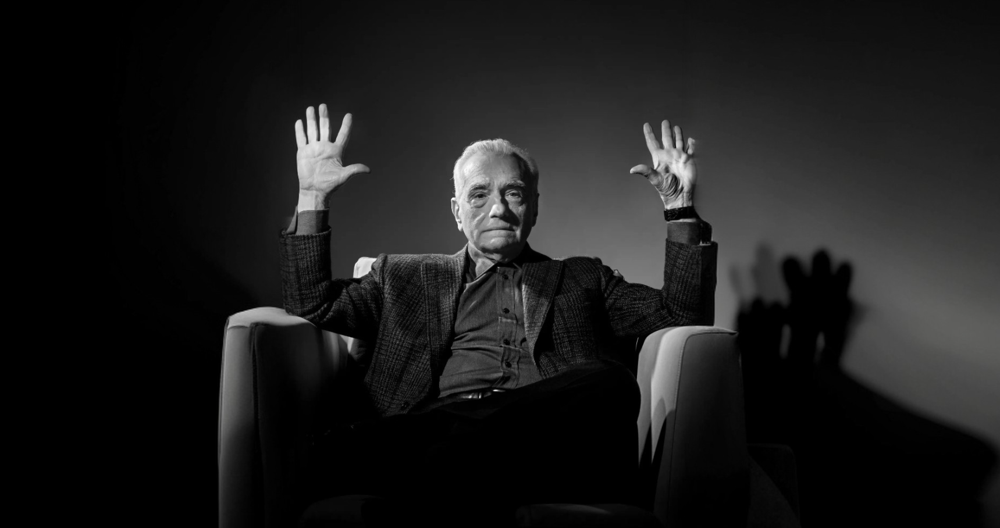

# Лабораторная работа №1

### **ФИО:** Конкин Александр Александрович
### **Группа:** 6402-010302D
### **Научный руководитель:** Минаев Евгений Юрьевич
### **Тема диплома:** Разарботка метода одновременной локализации и построения карты с использованием нейросетевых алгоритмов реконструкции сцены
> ### "Absolute cinema"
>
> #### — *Мартин Скорсезе*

# Лабораторная работа №2

**Тема:** «Chronos Tours» — сайт туристического агентства путешествий во времени.

**Страницы** (папка `lab2/`):
- `index.html` — главная: приветствие, цитата Рэя Брэдбери, карточки преимуществ;
- `tours.html` — каталог эпох: таблица маршрутов с уровнем риска и стоимостью;
- `safety.html` — памятка хрононавта: изображение, правила безопасности, контакты.

**HTML:** блочные (`header`, `main`, `section`, `blockquote`, `table`) и строчные (`em`, `strong`, `span`, `small`, `cite`) элементы, ссылки (меню, `mailto:`, `tel:`), изображение, таблица.

**CSS** (отдельный файл `style.css`):
- селекторы: по тегу (`body`, `h1`, `p`), по классу (`.tour-table`, `.risk-badge`, `.warning-box`), по ID (`#main-terminal`, `#timeline-nav`), псевдокласс (`.nav-link:hover`);
- выравнивание в таблице: по левому краю, по центру и по правому краю;
- тёмная палитра с янтарным акцентом;
- без испольхования сторонних библиотек.